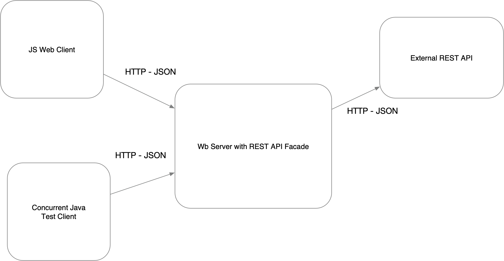
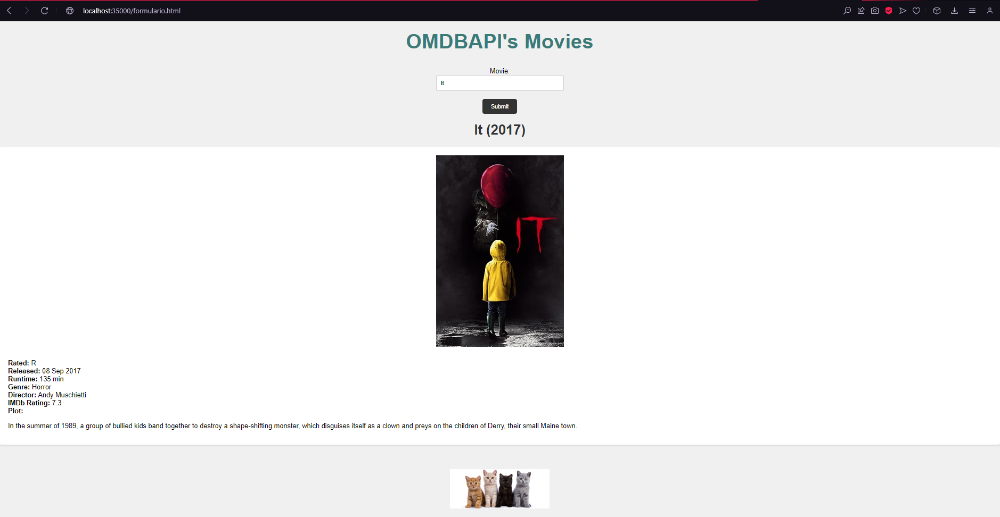
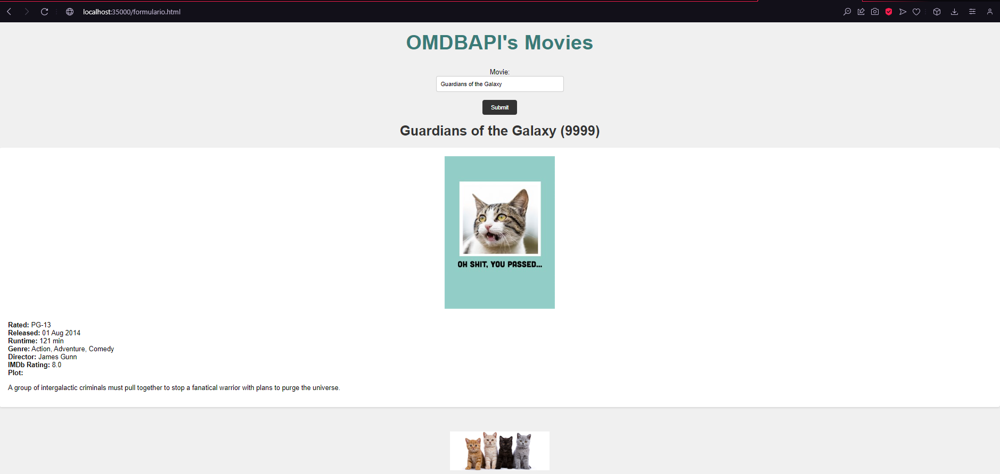
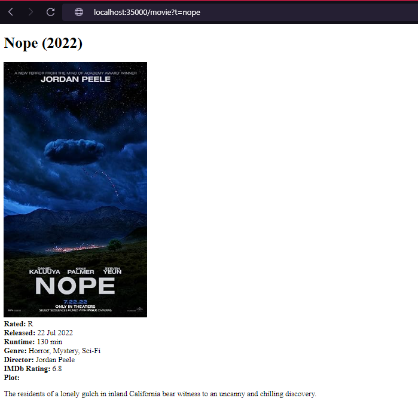

# Lab04-AREP

## Descripción

Este proyecto consiste en la implementación de un servidor web en Java, similar en funcionalidad al servidor Apache, que puede manejar solicitudes HTTP, servir archivos estáticos como páginas HTML e imágenes, y proporcionar un marco de trabajo IoC (Inversion of Control) para la construcción de aplicaciones web a partir de POJOS (Plain Old Java Objects). Además, se incluye una aplicación web de ejemplo construida sobre este servidor.

## Arquitectura del Prototipo

El prototipo sigue una arquitectura cliente-servidor, donde el servidor HTTP actúa como el servidor que escucha las solicitudes entrantes de los clientes. El servidor utiliza un enfoque asíncrono para manejar las solicitudes de manera eficiente, utilizando múltiples subprocesos.

## Estructura del Repositorio

El repositorio contiene el código fuente del proyecto, que está estructurado y gestionado utilizando Apache Maven.

### Componentes Principales

1. **Servidor HTTP**: Representa el servidor web principal que maneja las solicitudes HTTP entrantes.
2. **Manejador de Solicitudes**: Encargado de procesar las solicitudes HTTP y dirigirlas al controlador correspondiente.
3. **Controladores**: Funciones lambda que procesan las solicitudes HTTP y generan respuestas dinámicas.
4. **Lector de Archivos en Disco**: Utilizado para leer archivos estáticos del sistema de archivos local y servirlos como respuesta.
5. **Framework IoC**: Permite la carga dinámica de componentes desde el classpath, basándose en anotaciones como `@Component` y `@GetMapping`.

### Flujo de Trabajo

1. El cliente envía una solicitud HTTP al servidor para un recurso específico (como un archivo HTML o una consulta REST).
2. El servidor HTTP recibe la solicitud y la pasa al manejador de solicitudes.
3. El manejador de solicitudes determina el tipo de método HTTP utilizado y llama al controlador correspondiente para procesar la solicitud.
4. El controlador procesa la solicitud, lee el archivo del disco local si es necesario y genera la respuesta.
5. La respuesta se envía de vuelta al cliente a través del servidor HTTP.



## Ejemplo de Uso

- A continuación se muestra un ejemplo de cómo se desarrollarían las aplicaciones en este servidor:

    ```java
          @Component
          public class WebComponents {
  
            @GetMapping("/")
            public static String index(String requestBody, URI requestUri, String method) {
            return "<h1>Welcome to My Web Application</h1>";
            }
          }
    ```

- Un ejemplo de una solicitud GET
  

- Un ejemplo de una solicitud POST, agregando el dato: `curl -X POST http://localhost:35000/movie -d "Title=Guardians%20of%20the%20Galaxy&Year=9999&Rated=PG-13&Released=01%20Aug%202014&Runtime=121%20min&Genre=Action,%20Adventure,%20Comedy&Director=James%20Gunn&Writer=James%20Gunn,%20Nicole%20Perlman,%20Dan%20Abnett&Actors=Chris%20Pratt,%20Vin%20Diesel,%20Bradley%20Cooper&Plot=A%20group%20of%20intergalactic%20criminals%20must%20pull%20together%20to%20stop%20a%20fanatical%20warrior%20with%20plans%20to%20purge%20the%20universe.&Language=English&Country=United%20States&Awards=Nominated%20for%202%20Oscars.%2052%20wins%20&%20103%20nominations%20total&Poster=https://www.scribbler.com/Images/Product/Default/medium/SCR2147.jpg&Ratings=[{"Source":"Internet%20Movie%20Database","Value":"8.0/10"},{"Source":"Rotten%20Tomatoes","Value":"92%"},{"Source":"Metacritic","Value":"76/100"}]&Metascore=76&imdbRating=8.0&imdbVotes=1,261,888&imdbID=tt2015381&Type=movie&DVD=15%20Nov%202015&BoxOffice=$333,718,600&Production=N/A&Website=N/A&Response=True"`
  
  Se verifica que el dato halla sido agregado correctamente:
  

- Un ejemplo de la lectura de parametros desde el query:

  

Las pruebas incluyeron la verificación de las siguientes funcionalidades:

- Registro de servicios web de tipo GET y POST.
- Entrega de archivos estáticos como páginas HTML, CSS, JS e imágenes.
- Configuración del directorio de archivos estáticos.
- Lectura de parámetros del query desde los programas.

## Instrucciones de Ejecución

Para ejecutar el proyecto, sigue estos pasos:

1. Clona el repositorio desde GitHub.
2. **Compilar el Proyecto:** Ejecutar `mvn compile`.
3. **Ejecutar el Servidor:** Ejecutar `mvn exec:java -Dexec.mainClass="com.example.runtime.HttpServer"`.
4. **Acceder a la Interfaz de Usuario:** Entrar desde un navegador a `http://localhost:35000/formulario.html`.

